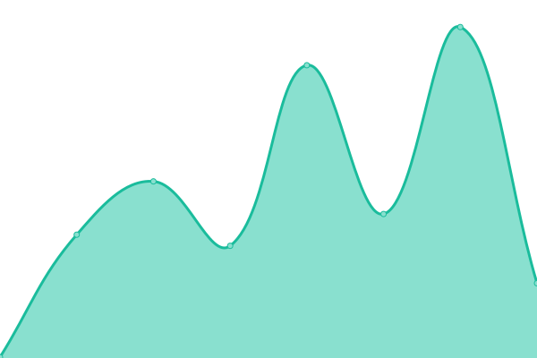

# 📈 Live Status: <!--live status--> **🟩 All systems operational**

<!--start: status pages-->
<!-- This summary is generated by Upptime (https://github.com/upptime/upptime) -->
<!-- Do not edit this manually, your changes will be overwritten -->
<!-- prettier-ignore -->
| URL | Status | History | Response Time | Uptime |
| --- | ------ | ------- | ------------- | ------ |
|  [Website](https://leavesmc.org/) | 🟩 Up | [website.yml](https://github.com/LeavesMC/Status/commits/HEAD/history/website.yml) | 

 409ms
     
 | 

<a href="https://LeavesMC.github.io/Status/history/website">100.00%</a>
    

|  [Documentation](https://docs.leavesmc.org/) | 🟩 Up | [documentation.yml](https://github.com/LeavesMC/Status/commits/HEAD/history/documentation.yml) | 

 726ms
     
 | 

<a href="https://LeavesMC.github.io/Status/history/documentation">100.00%</a>
    

|  [Repository](https://repo.leavesmc.org/) | 🟩 Up | [repository.yml](https://github.com/LeavesMC/Status/commits/HEAD/history/repository.yml) | 

 853ms
     
 | 

<a href="https://LeavesMC.github.io/Status/history/repository">100.00%</a>
    

|  [API](https://api.leavesmc.org/v2/docs) | 🟩 Up | [api.yml](https://github.com/LeavesMC/Status/commits/HEAD/history/api.yml) | 

 471ms
     
 | 

<a href="https://LeavesMC.github.io/Status/history/api">99.89%</a>
    

<!--end: status pages-->
